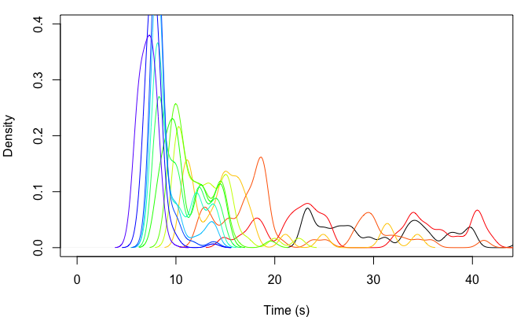
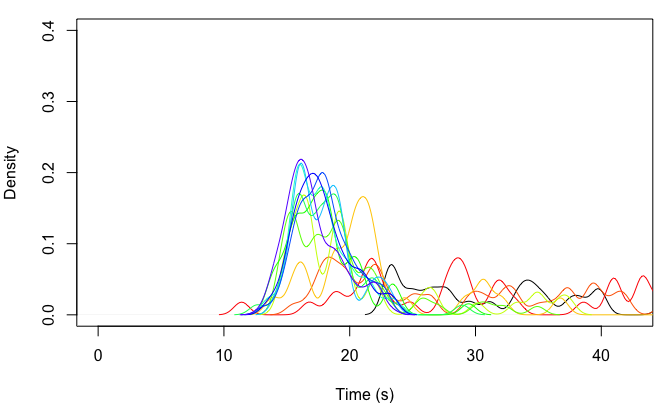

Speed Climbing ABM
================
Mason Youngblood


This agent-based model simulates a dynamic population of professional
speed climbers, and incorporates parameters for athletic improvement,
innovation of “beta” (or route sequence), and copying of other climbers’
beta.

## Athletic Improvement

The biggest challenge in developing this model was figuring out how to
simulate athletic improvement. I ended up assigning each climber a
truncated normal distribution from 0 to 1 that changes over time and
controls the amount of time spent on each hold. Here is a plotted
example of what this looks like. The example starting distribution has a
mean of 1 and a standard deviation of 0.1, but as the distribution
shifts to the left the amount of time spent on each hold, and thus the
overall climbing time, will get lower and lower.

``` r
#store distribution statistics (mean and sd)
dist_stats <- c(1, 0.1)

#generate range
range <- seq(0, 1, by = 0.001)

#construct and normalize dist so max is 1
dist <- truncnorm::dtruncnorm(range, a = 0, b = 1, mean = dist_stats[1], sd = dist_stats[2])
dist <- dist/max(dist)

#plot it
par(mar = c(4, 4, 1, 1))
plot(range, dist, type = "l", xlab = "P", ylab = "Density", xlim = c(0, 1))
```

<!-- -->

In order to simulate improvement in this distribution, we will randomly
draw a point sample and use it as the new mean of the normal
distribution in the next timestep. In order to “hit the brakes” on
improvement, the standard deviation of each new distribution will be the
`init_sd` multiplied by the new mean raised to the power of `brakes`.
For this first example we’ll use `init_sd` = 0.1 and `brakes` = 2.

``` r
#set seed
set.seed(1234)

#set initial sd and brakes values
init_sd <- 0.1
brakes <- 2

#store distribution statistics (mean and sd)
dist_stats <- c(1, init_sd)

#begin plot
par(mar = c(4, 4, 1, 1))
plot(range, dist, type = "l", xlab = "P", ylab = "Density", xlim = c(0, 1))

#colors for plotting after each timepoint
colors <- rainbow((20-1)*1.25) #times 1.2 so it doesn't loop back around

#iterate
for(i in 1:20){
  #replace mean with point sample multiplied by improve
  dist_stats[1] <- truncnorm::rtruncnorm(1, a = 0, b = 1, mean = dist_stats[1], sd = dist_stats[2])
  
  #replace sd with initial sd multiplied by the new mean to the power of brakes
  dist_stats[2] <- init_sd*(dist_stats[1]^brakes)
  
  #create new dist to plot normalize it
  dist <- truncnorm::dtruncnorm(range, a = 0, b = 1, mean = dist_stats[1], sd = dist_stats[2])
  dist <- dist/max(dist)
  
  #plot new line
  lines(range, dist, type = "l", col = colors[i])
}
```

<!-- -->

Now let’s set increase `init_sd` to 0.4 and `brakes` to 8 and see what
happens.

<!-- -->

As you can see, we can get a wide range of outcomes by varying these two
simple parameters.

## Beta & Reference Times

Now, how do we use these distributions in combination with hold
sequences? First, let’s look at a diagram of the standardized speed
wall.


As you can see, the standardized speed wall has a total of 20 hand holds
and 11 foot holds. Speed climbers often “smear” their feet on the wall
or use hand holds for feet, so we will only be modeling the time spent
on hand holds. Each climber will be initialized with a vector of their
beta, or a TRUE/FALSE for whether they use each hand hold in the route,
along with a vector of sequence ratios. The sequence ratios will be
drawn from a truncated normal distribution with a lower bound at 0, a
mean of 1, and a standard deviation parameter that controls the initial
variation in times across holds. The actual amount of time spent on each
hold, then, will be these sequence ratios multiplied by an initial
climbing time (let’s say 18 seconds) divided by the number of holds. For
now the beta vectors will start out as all TRUE, so that all climbers
start out using every hold in the route. Here is an example of how the
beta and sequence ratio vectors are initialized.

``` r
#set number of holds
n_holds <- 20

#set initial mean speed
init_time <- 18

#set probability of initial beta holds at 1 (all holds on the route)
beta_true_prob <- 1

#set parameter controlling the SD of sequence ratios
sd_multiplier <- 0.5

#initialize starting beta
beta <- sample(c(TRUE, FALSE), n_holds, prob = c(beta_true_prob, 1-beta_true_prob), replace = TRUE)

#initialize sequence ratios
seq_ratios <- truncnorm::rtruncnorm(n_holds, a = 0, mean = 1, sd = sd_multiplier)

#print the beta and climbing time vectors
beta
```

    ##  [1] TRUE TRUE TRUE TRUE TRUE TRUE TRUE TRUE TRUE TRUE TRUE TRUE TRUE TRUE TRUE
    ## [16] TRUE TRUE TRUE TRUE TRUE

``` r
(init_time/n_holds)*seq_ratios
```

    ##  [1] 1.39603390 0.68598311 0.58075198 0.67443387 0.16690794 0.37457133
    ##  [7] 0.29655306 0.76756776 0.69034611 1.55227332 0.41911077 0.51508591
    ## [13] 0.77371965 0.45254697 0.46416856 0.40170681 0.33660635 0.66427735
    ## [19] 0.67641752 0.08728593

This `sd_multiplier` value of 0.5 generates a distribution of times per
hold that is similar to the example distribution in [Reveret et
al. (2020)](https://www.frontiersin.org/articles/10.3389/fpsyg.2020.02188/full)
(see below), and is close to the variation in times per hold observed in
lead climbing [(Seifert et al.,
2020)](https://www.tandfonline.com/doi/full/10.1080/14763141.2020.1830161).
A more recent study that estimated times per hold for two high-level
climbers in the 2019 IFSC World Cup suggests that an `sd_multiplier`
value of 0.33 may be more appropriate [(Pandurevic et al.,
2022)](https://www.mdpi.com/1424-8220/22/6/2251), but in exploratory
analyses the posterior for this parameter converged to 0.5. We will make
a simplifying assumption and use 0.5 for all of our simulations.

<!-- -->

In each timestep, each climber has a certain `innov_prob` probability of
innovation. Innovations are changes to the beta of the route, in this
case flipping one of the booleans of the `beta` vector from TRUE to
FALSE (or vice versa). Not all boolean flips are possible. The parameter
`adj_poss` controls the number of successive FALSE booleans that are
allowed in the model (to simulate the fact that skipping three holds in
a row and still being able to complete the route is *extremely*
unlikely). When a boolean flip occurs (i.e. when a hold is added to or
dropped from the beta) the `seq_ratios` of the adjacent holds are
resampled (based on the mean initial climbing times of the population),
since the amount of time spent on the adjacent holds is dependent on the
presence of the added/dropped hold. When each climber innovates, they
compare the overall route time for their current beta with the innovated
beta, and if the innovated beta is better then they overwrite their
current beta. See `SpeedClimbingABM.R` for details.

## Social Learning

In each timestep, each climber also has a certain `learn_prob`
probability of copying the beta of another climber. When a climber
copies another climber, they only have access to the top `n_top` fastest
climbers in the current timestep. They “try out” all of the betas of the
fastest climbers that are different from their own beta, and if one of
them yields a faster time then they overwrite their current `beta` and
`seq_ratios` with those of better beta. See `SpeedClimbingABM.R` for
details.

## Dynamic Population Size

We also allow the population size to grow over time. For now we just
have a dynamic population size of `n` climbers and the probability
`leave_prob` of leaving the sport in each timestep. Basically, at the
end of each timestep a random subset of climbers leave the sport, and
new climbers enter the sport to bring the population up to the size
specified by `n`. The probability of a climber leaving the sport is a
function of how far their current record is from the current best among
climbers of the same gender as well as how long they’ve been in the
sport, so older climbers with slower times are more likely to leave.
Specifically it is their `current_record` divided by the minimum
`current_record` in the population multiplied by `age`, or the number of
timesteps that they have been in the sport. Each new climber that enters
the sport inherits information from two randomly sampled climbers from
that timestep: `seq_ratios` and `beta` come from one, and `dist` comes
from another. See `SpeedClimbingABM.R` for details.

## Interaction Effects

For our study, we want to add some interaction effects between
innovation, social learning, ranking, and population size. More
specifically, we want to innovation and social learning change with
climbers’ current rankings and with population size. To do this, we will
adjust the mean innovation and social learning rates of the population
with the following two equations for innovation and social learning,
respectively:

*μ* = *μ*<sub>*a**v**g*</sub> + (*μ*<sub>*a**v**g*</sub> \* *t*<sub>*n**o**r**m*</sub> \* *ϕ*) + (*μ*<sub>*a**v**g*</sub> \* *p*<sub>*n**o**r**m*</sub> \* *ω*)

*λ* = *λ*<sub>*a**v**g*</sub> + (*λ*<sub>*a**v**g*</sub> \* *t*<sub>*n**o**r**m*</sub> \* *ϵ*) + (*λ*<sub>*a**v**g*</sub> \* *p*<sub>*n**o**r**m*</sub> \* *σ*)

In each case there are three parameters in play. For innovation (*μ*)
there is the population average (*μ*<sub>*a**v**g*</sub>), the effect of
a climber’s record time (*ϕ*), and the effect of population size (*ω*).
The effects of time and population size are computed as follows: (1) all
values are collected and normalize to be between -0.5 and 0.5 (to
prevent *μ* from taking a value that is negative or greater than 1), (2)
the normalized values are multiplied by number between -1 and 1, where
the sign and absolute value control the direction and strength of the
effect, respectively, and (3) the values are the multiplied by the
innovation rate. Social learning is computed identically.

## Test Run

The ABM functions are in the `SpeedClimbingABM.R` file. Please refer to
the functions in this file for details.

``` r
source("SpeedClimbingABM.R")
```

Let’s do a test run of this model based on the observed data from the
women in the population.

``` r
load("data.RData")
data <- data[which(data$gender == "W"), ]
```

First we need the observed population sizes, leave probabilities, and
initial climbing times.

``` r
#get years
years <- sort(unique(data$year))

#population sizes
n <- unlist(lapply(1:length(years), function(x){nrow(data[which(data$year == years[x]), ])}))

#leave probabilities
leave_prob <- unlist(lapply(1:(length(years)-1), function(x){
  temp_a <- data[which(data$year == years[x]), ]
  temp_b <- data[which(data$year == years[x+1]), ]
  length(which(!(temp_a$athlete %in% temp_b$athlete)))/nrow(temp_a)
}))

#initial climbing times
init_times <- data[which(data$year == years[1]), ]$time

#get initial sd
init_sd <- sd(data$time[which(data$year == sort(unique(data$year))[1])]/mean(data$time[which(data$year == sort(unique(data$year))[1])]))
```

Now let’s run the model with an initial population size of 37, a 0.2
probability of learning from the top 20 climbers, and a 0.2 probability
of innovation where no more than 2 adjacent holds can be skipped. `bw`
and `ylim`, control the density bandwidth and y-axis limit in the plot,
respectively. `sum_stats` controls whether summary statistics are
calculated from the output, `plot` controls whether the output is
plotted, and `bw` and `ylim` control the density bandwidth and y-axis
limit of the plot, respectively.

``` r
#store starting time
start <- Sys.time()

#run model
output <- SpeedClimbingABM(n = n, leave_prob = leave_prob, init_times = init_times,
                           n_holds = 20, beta_true_prob = 1, learn_prob = 0.2, n_top = 20,
                           innov_prob = 0.2, adj_poss = 2, init_sd = 0.2, brakes = 4,
                           sum_stats = TRUE, plot = TRUE, bw = 0.6, ylim = 0.4)
```

<!-- -->

``` r
#print run time
Sys.time() - start
```

    ## Time difference of 0.227684 secs

In the above plot, each distribution (from right to left) is the
distribution of `current_records` for climbers in the population in each
timestep. The output of this ABM a table of the summary statistics
(quantiles) from each timestep.

``` r
output
```

    ##              0%       10%       20%       30%       40%       50%       60%
    ##  [1,] 23.010000 24.152000 26.850000 30.834000 34.506000 38.380000 47.348000
    ##  [2,] 18.207374 20.111509 21.870856 26.685864 29.908218 33.400654 34.718799
    ##  [3,] 17.829955 19.134213 19.720456 20.550032 22.008151 23.798115 26.326291
    ##  [4,] 13.890309 15.953146 16.980369 19.002059 19.784167 20.575479 21.537626
    ##  [5,] 13.210684 15.073646 15.854850 16.881863 17.686528 18.498566 20.411096
    ##  [6,] 10.533143 14.104895 14.919383 15.591357 16.117039 16.392723 18.245398
    ##  [7,] 10.953140 12.261510 12.778732 13.745301 14.271371 15.104426 16.006929
    ##  [8,]  9.632130 11.216622 12.499332 12.985282 13.458492 13.912812 14.415609
    ##  [9,]  9.213038 10.544393 11.615249 12.248451 12.385032 12.914140 13.285264
    ## [10,]  8.852904  9.938145 10.694822 10.953599 11.302213 11.812146 12.129492
    ## [11,]  7.500468  9.578087 10.212370 10.729076 11.249086 11.508541 11.921412
    ## [12,]  6.964948  7.919942  8.890363  9.430906  9.850215 10.306155 10.771370
    ## [13,]  6.429772  7.177086  7.879340  8.232059  9.040776  9.567353  9.932611
    ##            70%      80%      90%     100%
    ##  [1,] 50.29400 53.99400 62.84000 86.39000
    ##  [2,] 36.65554 44.42486 49.54890 74.57157
    ##  [3,] 30.01976 33.41658 35.71756 53.50222
    ##  [4,] 22.98116 26.12622 32.95123 38.56688
    ##  [5,] 21.59453 22.59920 28.01742 34.60569
    ##  [6,] 19.26305 19.67303 22.48037 35.87272
    ##  [7,] 16.63196 17.90797 19.33435 30.38075
    ##  [8,] 15.46387 16.76140 19.18855 31.16282
    ##  [9,] 13.90910 14.33426 15.72564 22.65121
    ## [10,] 12.51215 13.57320 15.55616 20.72228
    ## [11,] 12.55855 13.56455 15.05525 20.11989
    ## [12,] 11.35837 12.26732 13.70023 19.04326
    ## [13,] 10.70037 11.41649 12.82347 17.32342

Let’s do another run of the model, but let’s add interaction effects so
that climbers with slower times are more likely to learn
(`learn_x_times` = 1), climbers with faster times are more likely to
innovate (`innov_x_times` = -1), and both learning and innovation become
more common as population size increases (`learn_x_pop` and
`innov_x_pop` = 1).

``` r
#store starting time
start <- Sys.time()

#run model
output <- SpeedClimbingABM(n = n, leave_prob = leave_prob, init_times = init_times,
                           n_holds = 20, beta_true_prob = 1, learn_prob = 0, n_top = 20,
                           innov_prob = 0, adj_poss = 2, init_sd = 0.2, brakes = 4,
                           learn_x_times = 1, innov_x_times = -1, learn_x_pop = 1, innov_x_pop = 1,
                           sum_stats = TRUE, plot = TRUE, bw = 0.6, ylim = 0.4)
```

<!-- -->

``` r
#print run time
Sys.time() - start
```

    ## Time difference of 0.03970599 secs
