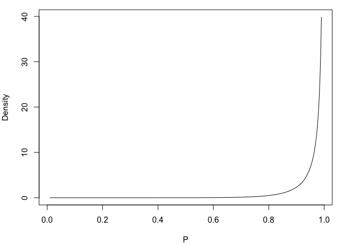
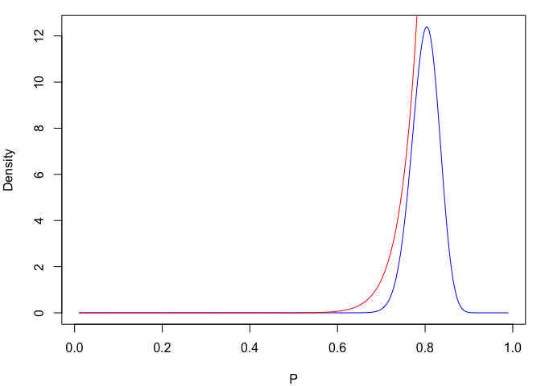
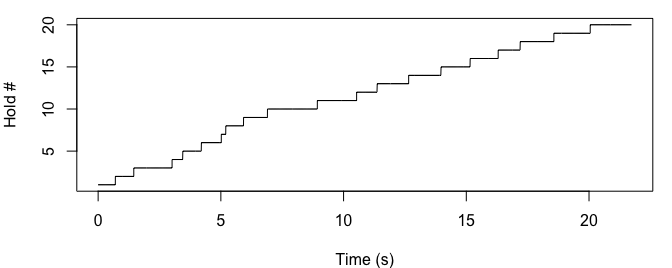
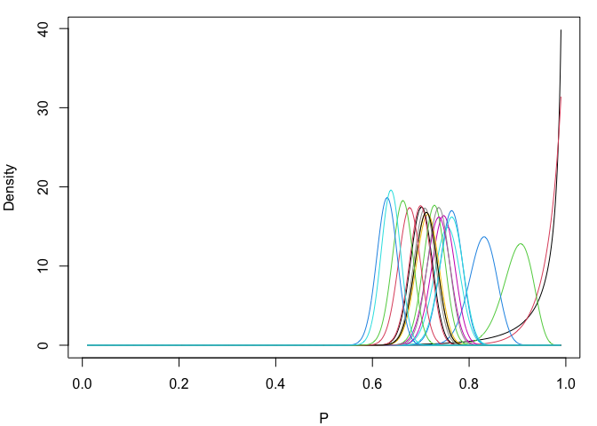
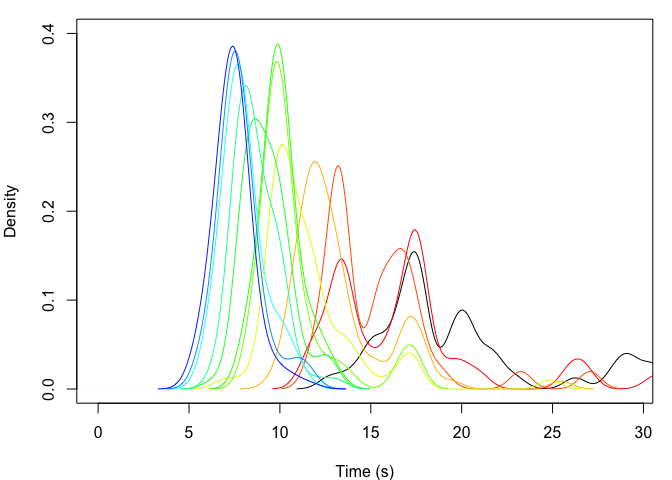

Speed Climbing ABM
================
Mason Youngblood


This agent-based model simulates a dynamic population of professional
speed climbers, and incorporates parameters for athletic improvement,
innovation of “beta” (or route sequence), and copying of other climbers’
beta.

## Athletic Improvement

The biggest challenge in developing this model was figuring out how to
simulation athletic improvement. I ended up assigning each climber a
beta distribution that changes over time and controls the amount of time
spent on each hold. In order to control the shape of the beta
distribution, I used the [following
function](https://stats.stackexchange.com/questions/12232/calculating-the-parameters-of-a-beta-distribution-using-the-mean-and-variance)
that converts a specified mean and variance into alpha and beta
parameters.

``` r
#function for calculating beta parameters
est_beta_params <- function(mean, var){
  #calculate alpha from mean and var
  alpha <- (((1-mean)/var)-(1/mean))*(mean^2)
  
  #calculate beta from alpha and mean
  beta <- alpha*((1/mean)-1)
  
  #return alpha and beta
  return(params = list(alpha = alpha, beta = beta))
}
```

With this function, we can easily construct beta distributions for each
climber. Here is a plotted exampe of what this looks like. This starting
distribution is heavily skewed towards 1, but as the distribution shifts
to the left the amount of time spent on each hold, and thus the overall
climbing time, will get lower and lower.

``` r
#generate range
range <- seq(0.01, 0.99, length.out = 1000)

#calculate parameters of beta dist
mean <- 0.99
var <- 0.001
beta_params <- est_beta_params(mean, var)

#construct and normalize dist
dist <- dbeta(range, beta_params$alpha, beta_params$beta)
dist <- (length(range)*dist)/sum(dist)

#plot it
par(mar = c(4, 4, 1, 1))
plot(range, dist, type = "l", xlab = "P", ylab = "Density")
```

<!-- -->

In order to simulate improvement in this distribution, we will construct
an exponential distribution with a max bound drawn from the current
distribution, and randomly draw the new mean of the distribution from
it. Below is an example of an exponential distribution (in red) drawn
with a max bound drawn from a beta distribution (in blue).

<!-- -->

If we iterate this out, we can see that the distribution shifts to the
left over time. In this case, the rate of the exponential curves
controls the rate of athletic improvement, where larger values mean that
the distributions shifts more slowly over time. For now, let’s set the
rate to 100. Note that, when calculating the parameters of the new beta
distribution, the variance is multiplied by the peak of the current
distribution to the power of 2, in order to “hit the brakes” on
directional improvement.

``` r
#set rate of exp curves when sampling
rate <- 100

#begin plot
par(mar = c(4, 4, 1, 1))
plot(range, dist, type = "l", xlab = "P", ylab = "Density")

#iterate
for(i in 1:20){
  #sample the max bound of exp distribution from the current distribution
  sampled_max <- sample(range, 1, prob = dist)
  
  #sample the exp distribution
  exp <- range[which(range <= sampled_max)]^rate
  
  #draw random point sample from exp distribution
  point_sample <- sample(range[which(range <= sampled_max)], 1, prob = exp)
  
  #create new dist with point sample as the mean
  beta_params <- est_beta_params(point_sample, var*(range[which.max(dist)]^2))
  dist <- dbeta(range, beta_params$alpha, beta_params$beta)
  
  #normalize it
  dist <- (length(range)*dist)/sum(dist)
  
  #plot new line
  lines(range, dist, type = "l", col = i+1)
  
  #remove temporary objects
  rm(list = c("sampled_max", "exp", "point_sample", "beta_params"))
}
```

<!-- -->

Now let’s set the rate to 20 and see what happens.

<!-- -->

As you can see a lower rate parameter for the exponential distribution
causes athletic improvement to happen at a faster rate over time, but
the rate of improvement slows down over time because how how we are
handling the variance. If we assign each climber a different rate
parameter for the exponential distributions then we can model variation
in climbers’ athletic ability.

## Beta & Reference Times

Now, how do we use these beta distributions in combination with hold
sequences? First, let’s look at a diagram of the standardized speed
wall.


As you can see, the standardized speed wall has a total of 20 hand holds
and 11 foot holds. Speed climbers often “smear” their feet on the wall
or use hand holds for feet, so we will only be modeling the time spent
on hand holds. Each climber will be initialized with a vector of their
beta, or a TRUE/FALSE for whether they use each hand hold in the route,
along with a vector of reference times for the amount of time spent on
each hold. For now the beta vectors will start out as all TRUE, so that
all climbers start out using every hold in the route. The reference
times will be drawn from truncated normal distributions with a lower
bound at 0, a mean of an initial climbing time (let’s say 18 seconds)
divided by the number of holds on the route, and a standard deviation of
the mean divided by a parameter that controls the initial variation in
times across holds. Here is an example of how the beta and reference
time vectors are initialized.

``` r
#set number of holds
n_holds <- 20

#set initial mean speed
init_time <- 18

#set probability of initial beta holds at 1 (all holds on the route)
beta_true_prob <- 1

#set parameter controlling the SD of ref times
sd_divider <- 10

#initialize starting beta
beta <- sample(c(TRUE, FALSE), n_holds, prob = c(beta_true_prob, 1-beta_true_prob), replace = TRUE)

#initialize ref times
ref_times <- truncnorm::rtruncnorm(n_holds, a = 0, mean = init_time/n_holds, sd = (init_time/n_holds)/sd_divider)

#print the vectors
beta
```

    ##  [1] TRUE TRUE TRUE TRUE TRUE TRUE TRUE TRUE TRUE TRUE TRUE TRUE TRUE TRUE TRUE
    ## [16] TRUE TRUE TRUE TRUE TRUE

``` r
ref_times
```

    ##  [1] 0.8038051 0.8593267 0.7700473 0.9091619 1.0854914 0.9513782 0.8701519
    ##  [8] 0.9408317 0.8804831 0.9408589 0.9188010 0.9049235 0.8022548 0.9892346
    ## [15] 0.5895793 0.9927162 0.7099631 0.7919213 0.8809420 0.9009371

In each timestep, each climber has the same `innov_prob` probability of
innovation. Innovations are changes to the beta of the route, in this
case flipping one of the booleans of the `beta` vector from TRUE to
FALSE (or vice versa). Not all boolean flips are possible. The parameter
`adj_poss` controls the number of successive FALSE booleans that are
allowed in the model (to simulate the fact that skipping three holds in
a row and still being able to complete the route is *extremely*
unlikely). When a boolean flip occurs (i.e. when a hold is added to or
dropped from the beta) the `ref_times` of the adjacent holds are
resampled (based on the mean initial climbing times of the population),
since the amount of time spent on the adjacent holds is dependent on the
presence of the added/dropped hold. When each climber innovates, they
compare the overall route time for their current beta with the innovated
beta, and if the innovated beta is better then they overwrite their
current beta. See `SpeedClimbingABM.R` for details.

## Social Learning

In each timestep, each climber also has the same `learn_prob`
probability of copying the beta of another climber. When a climber
copies another climber, they only have access to the top `n_top` fastest
climbers in the current timestep. They “try out” all of the betas of the
fastest climbers that are different from their own beta, and if one of
them yields a faster time then they overwrite their current `beta` and
`ref_times` with those of better beta. See `SpeedClimbingABM.R` for
details.

## Dynamic Population Size

We also allow the population size to grow over time. For now we just
have a dynamic population size of `n` climbers and the probability
`leave_prob` of leaving the sport in each timestep. Basically, at the
end of each timestep a random subset of climbers leave the sport, and
new climbers enter the sport to bring the population up to the size
specified by `n`. The probability of a climber leaving the sport is a
function of how far their current record is from the current best as
well as how long they’ve been in the sport, so older climbers with
slower times are more likely to leave. Specifically it is their
`current_record` divided by the minimum `current_record` in the
population multiplied by `age`, or the number of timesteps that they
have been in the sport. Each new climber that enters the sport inherits
information from two randomly sampled climbers from that timestep:
`ref_times` and `beta` come from one, and `dist` comes from another. See
`SpeedClimbingABM.R` for details.

## Test Run

The ABM functions are in the `SpeedClimbingABM.R` file. Please refer to
the functions in this file for details.

``` r
source("SpeedClimbingABM.R")
```

Let’s do a test run of this model based on the observed data for male
climbers.

``` r
load("data.RData")

#subset to males
data <- data[which(data$gender == "M"), ]
```

First we need the observed population sizes, leave probabilities, and
initial climbing times.

``` r
#get years
years <- sort(unique(data$year))

#population sizes
n <- unlist(lapply(1:length(years), function(x){nrow(data[which(data$year == years[x]), ])}))

#leave probabilities
leave_prob <- unlist(lapply(1:(length(years)-1), function(x){
  temp_a <- data[which(data$year == years[x]), ]
  temp_b <- data[which(data$year == years[x+1]), ]
  length(which(!(temp_a$athlete %in% temp_b$athlete)))/nrow(temp_a)
}))

#initial climbing times
init_times <- data[which(data$year == years[1]), ]$time
```

Now let’s run the model with an initial population size of 53, a 0.4
probability of learning from the top 20 climbers, and a 0.2 probability
of innovation where no more than 3 adjacent holds can be skipped. The
last two parameters, `bw` and `ylim`, control the density bandwidth and
y-axis limit in the plot, respectively.

``` r
output <- SpeedClimbingABM(n = n, leave_prob = leave_prob, init_times = init_times,
                           n_holds = 20, beta_true_prob = 1, learn_prob = 0.4, n_top = 20,
                           innov_prob = 0.2, adj_poss = 3, rate_sd = 10, sd_divider = 2,
                           bw = 0.6, ylim = 0.35)
```

<!-- -->

In the above plot, each distribution (from right to left) is the
distribution of `current_records` for climbers in the population in each
timestep.
