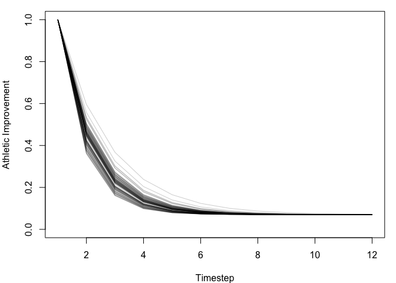
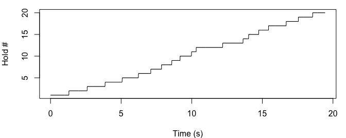
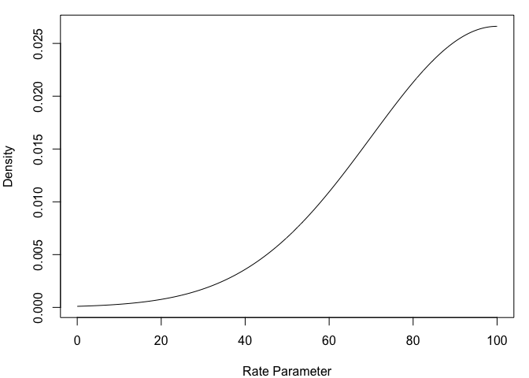
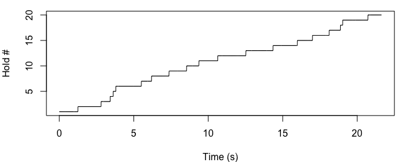
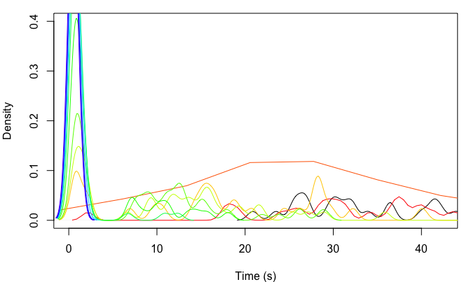

Speed Climbing ABM
================
Mason Youngblood


This agent-based model simulates a dynamic population of professional
speed climbers, and incorporates parameters for athletic improvement,
innovation of “beta” (or route sequence), and copying of other climbers’
beta.

## Athletic Improvement

Athletic improvement is simulated using a bounded exponential function
controlled by three parameters: `rate_m`, `rate_sd`, and `min`. `rate_m`
controls the mean exponential rate across all climbers, `rate_sd`
controls the standard deviation of the exponential rate to introduce
variation in ability, and `min` controls the asymptotic lower bound. The
result of this function is an `athletic_improvement` index for each
climber over time (x-axis). Below is an example with a `rate_m` of 2, a
`rate_sd` of 0.2, and a `min` of 0.4.

``` r
#bounded exponential function
bounded_exp <- function(x, rate, min){
  return((1-min)*(rate/rate^x)+min)
}

#generate values
x <- 1:12
rates <- truncnorm::rtruncnorm(100, a = 1, mean = 2, sd = 0.2)
y <- sapply(1:length(rates), function(h){bounded_exp(x, rates[h], 0.4)})

#plot
par(mar = c(4, 4, 1, 1))
matplot(x, y, type = "l", xlab = "Timestep", ylab = "Athletic Improvement", ylim = c(0, 1), col = scales::alpha("black", 0.2), lty = 1)
```

<!-- -->

In each timestep, a climbers current record comes from multiplying the
time per handhold by this `athletic_improvement` index. After the first
timestep, new climbers entering the population will have their
distribution of `athletic_improvement` indices divided by the
`athletic_improvement` value from the timestep that they enter. In this
way, a climber who enters the population with a lower climbing time will
follow the same general improvement trajectory as everyone else in the
population.

## Beta & Reference Times

Now, how do we use these distributions in combination with hold
sequences? First, let’s look at a diagram of the standardized speed
wall.


As you can see, the standardized speed wall has a total of 20 hand holds
and 11 foot holds. Speed climbers often “smear” their feet on the wall
or use hand holds for feet, so we will only be modeling the time spent
on hand holds. Each climber will be initialized with a vector of their
beta, or a TRUE/FALSE for whether they use each hand hold in the route,
along with a vector of sequence ratios. The sequence ratios will be
drawn from a truncated normal distribution with a lower bound at 0, a
mean of 1, and a standard deviation parameter that controls the initial
variation in times across holds. The actual amount of time spent on each
hold, then, will be these sequence ratios multiplied by an initial
reference climbing time per hold (initially their starting climbing time
divided by the number of holds). For now the beta vectors will start out
as all TRUE, so that all climbers start out using every hold in the
route. Here is an example of how the beta and sequence ratio vectors are
initialized.

``` r
#read in grid of holds and convert to meters
grid <- read.csv("grid.csv")
grid <- grid/1000

#euclidean distance function
euclidean <- function(x, skips){
  if(skips > 0){return(sqrt((grid$x[x+skips] - grid$x[x-skips])^2 + (grid$y[x+skips] - grid$y[x-skips])^2))}
  if(skips == 0){return(sqrt((grid$x[x] - grid$x[x-1])^2 + (grid$y[x] - grid$y[x-1])^2))}
}

#set number of holds
n_holds <- 20

#get distances between holds
dists <- sapply(1:n_holds, function(x){euclidean(x+1, 0)})

#set initial mean speed
init_time <- 18

#set probability of initial beta holds at 1 (all holds on the route)
beta_true_prob <- 1

#set parameter controlling the SD of sequence ratios
sd_multiplier <- 0.5

#initialize starting beta
beta <- sample(c(TRUE, FALSE), n_holds, prob = c(beta_true_prob, 1-beta_true_prob), replace = TRUE)

#initialize sequence ratios
seq_ratios <- truncnorm::rtruncnorm(n_holds, a = 0, mean = 1, sd = sd_multiplier)

#sort sequence ratios to match the distance order of the climbing holds
seq_ratios <- sort(seq_ratios)[rank(dists, ties.method = "first")]

#print the beta and climbing time vectors
beta
```

    ##  [1] TRUE TRUE TRUE TRUE TRUE TRUE TRUE TRUE TRUE TRUE TRUE TRUE TRUE TRUE TRUE
    ## [16] TRUE TRUE TRUE TRUE TRUE

``` r
(init_time/n_holds)*seq_ratios
```

    ##  [1] 0.1701498 1.1669407 1.3680521 1.0849181 0.5564661 1.0250596 1.1432280
    ##  [8] 0.8199482 1.6416732 0.7779875 0.5224821 1.2533509 0.9730208 0.6611103
    ## [15] 0.5133756 1.0901116 1.6430841 1.0126206 1.0764285 1.8622821

This `sd_multiplier` value of 0.5 generates a distribution of times per
hold that is similar to the example distribution in [Reveret et
al. (2020)](https://www.frontiersin.org/articles/10.3389/fpsyg.2020.02188/full)
(see below), and is close to the variation in times per hold observed in
lead climbing [(Seifert et al.,
2020)](https://www.tandfonline.com/doi/full/10.1080/14763141.2020.1830161).
A more recent study that estimated times per hold for two high-level
climbers in the 2019 IFSC World Cup suggests that an `sd_multiplier`
value of 0.33 may be more appropriate [(Pandurevic et al.,
2022)](https://www.mdpi.com/1424-8220/22/6/2251), but in exploratory
analyses the posterior for this parameter converged to 0.5. We will make
a simplifying assumption and use 0.5 for all of our simulations.

<!-- -->

In each timestep, each climber has a certain `innov_prob` probability of
innovation. Innovations are changes to the beta of the route, in this
case flipping one of the booleans of the `beta` vector from TRUE to
FALSE. Not all boolean flips are possible. We will include a parameter
`max_dist` that controls the maximum travel distance (Euclidean distance
in meters) that a climber can travel after skipping a hold. To our
knowledge, nobody has successfully skipped three or more holds in speed
climbing, so an appropriate prior will be chosen to reflect this. The
first hold can never be skipped, because every climber is required to
start on it. The Euclidean distance for the last hold will be the
distance between the second-to-last (or third-to-last) hold and the
buzzer.

Below are the distributions of distances between holds that are one and
two holds apart …

<!-- --><!-- -->

Among the available holds within `max_dist`, the probability of
innovating a hold will be based on two things: (1) the distance between
the adjacent holds, and (2) the ratio between the original path distance
and the new path distance. The first of these reflects a preference for
skipping holds that lead to smaller gaps in the route, and the second
reflects a preference for skipping holds that make the path more direct.
For both measures, we will rank the possible holds to skip in ascending
order by the distance (*R*<sub>*d**i**s**t*</sub>) and path ratio
(*R*<sub>*r**a**t**i**o*</sub>), invert them, and raise them to the
power of parameters `constraint_a` and `constraint_b`. So, the random
sampling of holds to skip will be weighted by the following:

(1/*R*<sub>*d**i**s**t*</sub>)<sup>*c**o**n**s**t**r**a**i**n**t*<sub>*a*</sub></sup> \* (1/*R*<sub>*r**a**t**i**o*</sub>)<sup>*c**o**n**s**t**r**a**i**n**t*<sub>*b*</sub></sup>

In other words, if skipping a hold means traversing a shorter and more
direct distance, then that hold will be more likely to be skipped.

See `SpeedClimbingABM.R` for more details.

## Social Learning

In each timestep, each climber also has a certain `learn_prob`
probability of copying the beta of another climber. When a climber
copies another climber, they only have access to the top `n_top` fastest
climbers in the current timestep. They “try out” all of the betas of the
fastest climbers that are different from their own beta, and if one of
them yields a faster time then they overwrite their current `beta` and
`seq_ratios` with those of better beta. See `SpeedClimbingABM.R` for
details.

## Population Size & Turnover

In the original version of the model we did not use all available
information about when specific climbers entered the sport, left the
sport, etc. This version was far too stochastic to use for inference, so
we are now incorporating this information explicitly into the model.
First let’s take a look at the data:

    ##       athlete gender   time year
    ##    1:    1474      W 25.170 2007
    ##    2:      42      W 23.450 2007
    ##    3:      71      W 50.060 2007
    ##    4:      46      W 23.260 2007
    ##    5:    4735      W 48.950 2007
    ##   ---                           
    ## 2007:    4206      W 15.058 2019
    ## 2008:    2651      W 15.494 2019
    ## 2009:    4215      W 18.339 2019
    ## 2010:    2636      W 20.085 2019
    ## 2011:    2625      W 21.796 2019

Each row is an climber in a particular year with their current record.
When a climber first enters the sport we will initialize them with their
current record in that year, and then we will simulate innovation,
learning, and athletic improvement from that baseline until they
eventually leave the sport. In the cases when climbers’ have gaps in
their careers we will treat them as separate cascades by re-initializing
their current record when they re-enter the sport and simulating change
from there. Climbers who only appear in the dataset once be initialized
with their current record in the year they appear and will disappear in
the next year with no simulated improvement (see below).

<!-- -->

To do this, let’s create a new `pop_data` object that includes all of
the information we need. Each row corresponds to a continuous sequence
of years: the first column is the climbers’ ID, the second is their
starting year, the third is their end year, and the fourth is their best
time in the starting year.

    ##         ID start  end   time
    ##    1: 1474  2007 2009 25.170
    ##    2:   42  2007 2007 23.450
    ##    3:   71  2007 2008 50.060
    ##    4:   46  2007 2009 23.260
    ##    5:   46  2011 2011 11.770
    ##   ---                       
    ## 1063: 4206  2019 2019 15.058
    ## 1064: 2651  2019 2019 15.494
    ## 1065: 4215  2019 2019 18.339
    ## 1066: 2636  2019 2019 20.085
    ## 1067: 2625  2019 2019 21.796

After the first timestep, each new climber that joins the population
will be initialized with a random `seq_ratios` and `beta` drawn from an
existing climber. See `SpeedClimbingABM.R` for details.

## Interaction Effects

For our study, we want to add some interaction effects between
innovation, social learning, ranking, and population size. More
specifically, we want to innovation and social learning change with
climbers’ current rankings and with population size. To do this, we will
adjust the mean innovation and social learning rates of the population
with the following two equations for innovation and social learning,
respectively:

*l**o**g**i**t*(*μ*) = *l**o**g**i**t*(*μ*<sub>*a**v**g*</sub>) + *t*<sub>*s**c**a**l**e*</sub> \* *ϕ* + *p*<sub>*s**c**a**l**e*</sub> \* *ω*

*l**o**g**i**t*(*λ*) = *l**o**g**i**t*(*λ*<sub>*a**v**g*</sub>) + *t*<sub>*s**c**a**l**e*</sub> \* *ϵ* + *p*<sub>*s**c**a**l**e*</sub> \* *σ*

The calculations are done on the logit scale so that everything remains
between 0 and 1. In each case there are three parameters in play. For
innovation (*μ*) there is the population average
(*μ*<sub>*a**v**g*</sub>), the effect of a climber’s record time (*ϕ*),
and the effect of population size (*ω*). The effects of time and
population size are computed as follows: (1) all values are scaled and
centered with a mean of 0 and standard deviation of 1, (2) the scale
values are multiplied by number between -1 and 1, where the sign and
absolute value control the direction and strength of the effect,
respectively, and (3) the values are the multiplied by the
logit-transformed innovation rate. Social learning is computed
identically.

## Test Run

The ABM functions are in the `SpeedClimbingABM.R` file. Please refer to
the functions in this file for details.

``` r
source("SpeedClimbingABM.R")
```

Let’s do a test run of this model based on the observed data from the
men in the population.

``` r
load("data.RData")
pop_data <- pop_data[which(data$gender[match(pop_data$ID, data$athlete)] == "M"), ]
data <- data[which(data$gender == "M"), ]
```

First we need the observed population sizes, leave probabilities, and
initial climbing times.

``` r
#get years
years <- sort(unique(data$year))

#population sizes
n <- unlist(lapply(1:length(years), function(x){nrow(data[which(data$year == years[x]), ])}))
```

Now let’s run the model with an initial population size of 53, a 0.2
probability of learning from the top 20 climbers, a 0.2 probability of
innovation, and `max_dist` = 3. The `improve_rate_m` of athletic
improvement will be 2, the `improve_rate_sd` will be 0.2, and the `min`
improvement possible will be 0.4. `bw` and `ylim`, control the density
bandwidth and y-axis limit in the plot, respectively. `sum_stats`
controls whether summary statistics are calculated from the output,
`plot` controls whether the output is plotted, and `bw` and `ylim`
control the density bandwidth and y-axis limit of the plot,
respectively.

``` r
#store starting time
start <- Sys.time()

#run model
output <- SpeedClimbingABM(n = n, years = years, pop_data = pop_data, grid = grid,
                           n_holds = 20, beta_true_prob = 1, learn_prob = 0.2, n_top = 20,
                           innov_prob = 0.2, max_dist = 3, improve_rate_m = 2, improve_rate_sd = 0.2, improve_min = 0.4,
                           sum_stats = TRUE, plot = TRUE, bw = 0.6, ylim = 0.4)
```

<!-- -->

``` r
#print run time
Sys.time() - start
```

    ## Time difference of 0.3331311 secs

In the above plot, each distribution (from right to left) is the
distribution of `current_records` for climbers in the population in each
timestep. The output of this ABM a table of the summary statistics
(quantiles) from each timestep.

``` r
output
```

    ##              0%       10%       20%       30%       40%       50%       60%
    ##  [1,] 15.400000 18.256000 20.408000 21.188000 24.432000 28.640000 29.712000
    ##  [2,]  8.080000 11.552000 13.031275 14.358661 16.848000 21.910000 25.317694
    ##  [3,]  5.815219  7.951326 10.298679 11.078051 11.654987 12.923353 15.385168
    ##  [4,]  5.023086  7.570127  8.780000  9.265000 10.139731 11.341157 12.410000
    ##  [5,]  4.627948  6.781499  7.228239  7.705525  8.043144  8.560000  9.201756
    ##  [6,]  4.430842  6.094815  6.437015  7.258000  7.760000  8.601718  9.274192
    ##  [7,]  5.385945  5.950849  6.602542  6.987448  7.278000  7.767843  8.780000
    ##  [8,]  4.965576  5.858203  6.430000  6.901401  7.447738  7.741000  8.574531
    ##  [9,]  5.036102  5.803397  6.183595  6.560000  6.995348  7.275538  7.904000
    ## [10,]  4.730695  5.777305  6.356000  6.692000  7.230000  7.640000  7.950000
    ## [11,]  4.392764  5.766372  6.260839  6.666004  7.142989  7.509785  8.169851
    ## [12,]  4.390699  5.880299  6.379534  6.711798  7.292777  7.703175  8.208600
    ## [13,]  4.389716  5.636350  6.035376  6.340600  6.851835  7.377000  7.971200
    ##             70%       80%      90%     100%
    ##  [1,] 32.472000 39.548000 43.25400 62.06000
    ##  [2,] 28.870972 30.598000 33.13300 48.08000
    ##  [3,] 17.345452 21.618489 26.82344 33.23000
    ##  [4,] 17.156926 21.570000 24.21684 31.90000
    ##  [5,] 11.028188 15.117621 18.54316 25.32337
    ##  [6,] 10.025129 12.569234 15.68238 18.31486
    ##  [7,] 11.015397 13.546000 17.25354 24.79000
    ##  [8,]  9.026400  9.659474 11.86200 24.15104
    ##  [9,]  8.324000  8.878000 11.16304 18.15000
    ## [10,]  8.502694 10.018000 12.05100 23.37000
    ## [11,]  8.703000  9.782000 11.03673 16.68508
    ## [12,]  8.878000  9.413400 10.44400 19.83000
    ## [13,]  8.397634  9.037207 10.21264 13.30600
